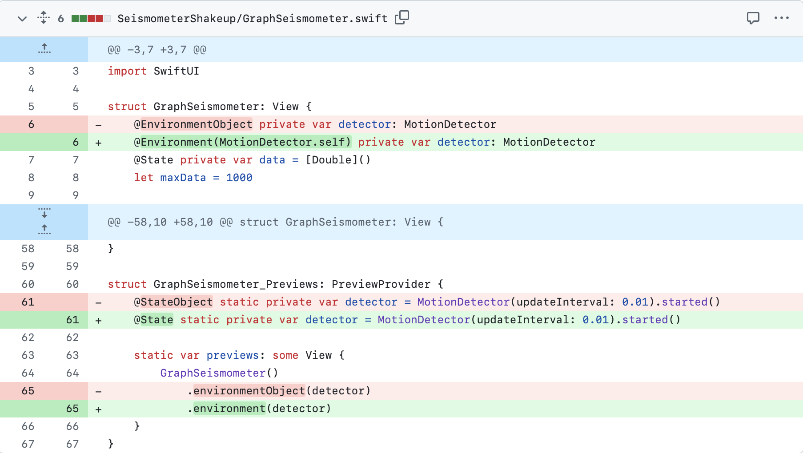
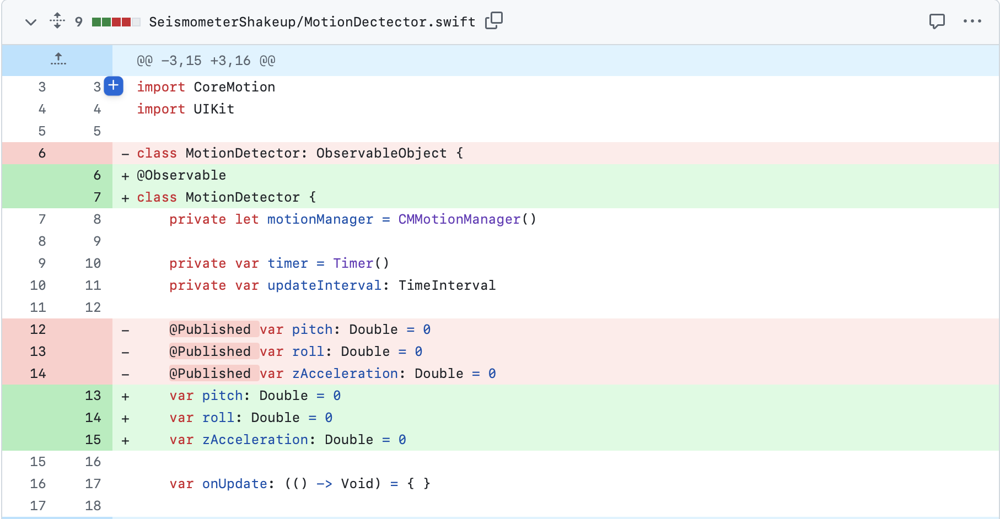
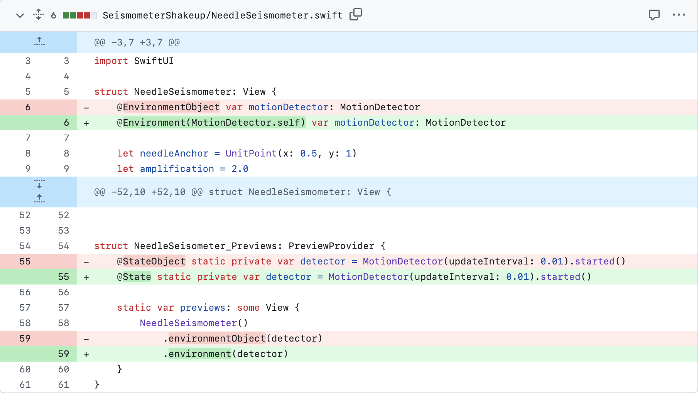
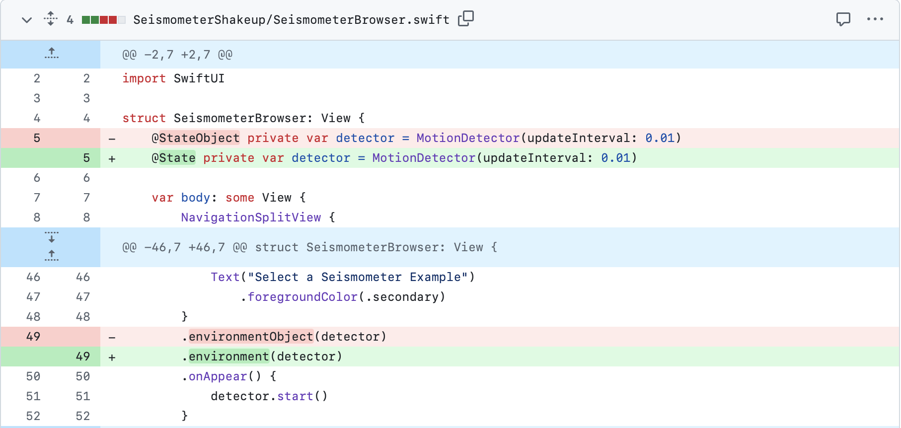

## Synopsis

This small app is meant to demonstrate how we take the original Seismometer app from [Seismometer](https://developer.apple.com/tutorials/sample-apps/seismometer) if we adopt [the Observable macro](https://developer.apple.com/documentation/swiftui/migrating-from-the-observable-object-protocol-to-the-observable-macro).

## First file PULL REQUEST

## Second file PULL REQUEST

## Third file PULL REQUEST

## Fourth file PULL REQUEST

## Contributors

Any suggested fixes, modifications, changes, and improvements are welcome to raise an issue or create a pull request
